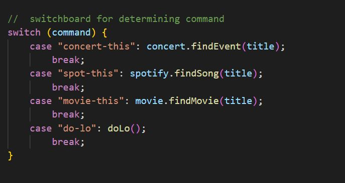
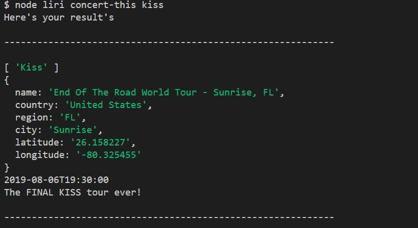
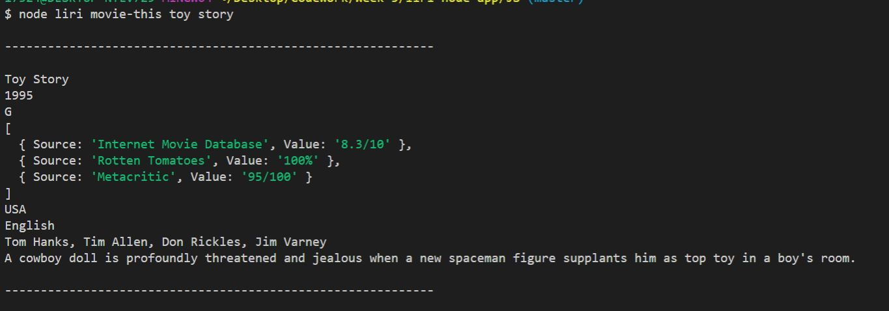

# LIRI

LIRI is a command line node application that works like siri, google, or alexa.

-	concert-this
-	spot-this
-	movie-this
-	do-lo

## How to Use

1. Git clone this repository 
2. Navigate to the root folder in cloned repository
3. Type in the command line "npm install" and wait for completion
4. Type npm start
5. Application should run on LocalHost:8080

## concert-this: 

This will search the Bands in Town Artist Events API for an artist and render the following information about each event to the terminal:

-	Name of the venue
-	Venue location
-	Date of the Event (use moment to format this as "MM/DD/YYYY")

## Spotify-this-song: 

This will show the following information about the song in your terminal/bash window

-	Artist(s)
-	The song's name
-	A preview link of the song from Spotify
-	The album that the song is from

## movie-this: 

This will output the following information to your terminal/bash window:
-	Title of the movie.
-	Year the movie came out.
-	IMDB Rating of the movie.
-	Rotten Tomatoes Rating of the movie.
-	Country where the movie was produced.
-	Language of the movie.
-	Plot of the movie.
-	Actors in the movie.

## do-lo: 

LIRI will use the text from “random.txt” and call on of LIRI’s commands. 
It should run Spotify-this-song for “I want it That way”. 

## Technologies used:

* Spotify API
* OMDB API
* Bands In Town API
* Node.js
* Javascript
* NPM packages
